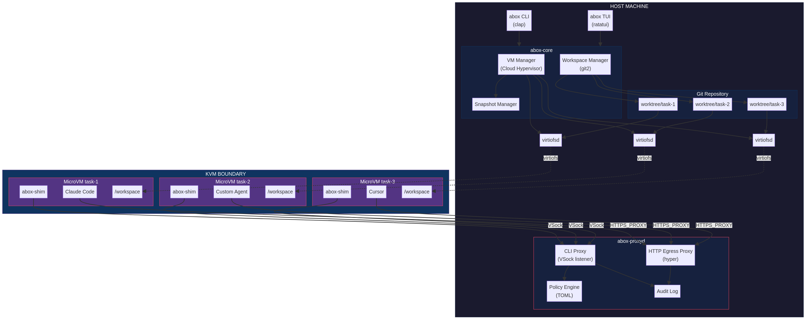

# abox — Parallel AI Agent Sandboxing

`abox` is a lightweight, secure tool for running multiple AI coding agents in parallel, isolated sandboxes. It combines **git worktrees** with **microVMs** (Cloud Hypervisor) to provide agents with independent workspaces, while securely proxying credentials via a dual-layer interception architecture.

## Why `abox`?

When running multiple autonomous agents on a single codebase, you face three problems:
1. **Workspace collisions:** Agents stepping on each other's git branches and files.
2. **Credential leaks:** Giving agents direct access to your AWS or GitHub tokens is dangerous.
3. **Host system risk:** Agents running `rm -rf /` or installing malware.

`abox` solves this by:
- Isolating each agent in a fast-booting **Cloud Hypervisor microVM**.
- Mounting independent **git worktrees** into the VM via `virtiofs`.
- Proxying commands and HTTP requests out of the VM through a **strict, TOML-configured policy engine**.
- Injecting API credentials into outbound HTTPS requests via a **TLS-terminating MITM proxy**, so secrets never enter the VM.

## Architecture

`abox` is built in Rust using a Hexagonal (Ports & Adapters) architecture.

1. **`abox-core`**: Domain logic (Workspace manager, VM lifecycle, Policy engine).
2. **`abox-cli`**: The user interface (CLI commands and TUI dashboard).
3. **`abox-proxyd`**: The host-side daemon that evaluates policies and executes allowed commands.
4. **`abox-shim`**: A static musl binary injected into the guest VM that intercepts commands (via symlinks) and forwards them to `proxyd`.



## Getting Started

### Prerequisites

- Linux host with `/dev/kvm` accessible to your user
- Rust toolchain (`cargo`)
- `just` command runner (`cargo install just`)

### Installation

> **Note:** abox is currently pre-release. The recommended install path is
> from source (below). A one-command installer will be available once the
> first release is published.

**From source** (recommended):

```bash
# Prerequisites: Rust (https://rustup.rs), just (cargo install just)
git clone https://github.com/X-McKay/abox.git
cd abox
cargo build --release
abox init             # guided first-run setup: downloads VM stack,
                      # writes config, installs default policy
```

Or run the steps individually:

```bash
just bootstrap-vm     # downloads the VMM, kernel, builds the rootfs,
                      # and symlinks the binaries into ~/.local/bin
abox doctor           # verify the environment before first use
```

`bootstrap-vm` is idempotent and uses checksummed cached downloads, so
re-running it is fast (seconds, not minutes). Currently supports **x86_64**
hosts only — aarch64 support is in progress. See
[`docs/vm-setup.md`](docs/vm-setup.md) for the full setup walkthrough.

**One-command install** (once a release is published):

```bash
curl -fsSL https://raw.githubusercontent.com/X-McKay/abox/main/scripts/install.sh | bash
```

### Documentation

- [`docs/tutorial.md`](docs/tutorial.md) — 10-minute walkthrough from
  `git clone` to your first sandbox
- [`docs/explainer.md`](docs/explainer.md) — architecture deep dive:
  what every component does and why
- [`docs/vm-setup.md`](docs/vm-setup.md) — VM stack installation +
  troubleshooting
- [`docs/decisions/`](docs/decisions/) — architecture decision records
- [`docs/future-work.md`](docs/future-work.md) — forward-looking
  roadmap; what's next and why

### Configuration

The easiest way to configure abox is to run `abox init`, which writes
`~/.abox/config.toml` with all paths pre-filled and installs the default
policy automatically.

To configure manually:

```bash
mkdir -p ~/.abox/policies
cp templates/config.example.toml ~/.abox/config.toml
cp policies/default.toml ~/.abox/policies/default.toml
# Then edit ~/.abox/config.toml to set image_path and kernel_path
# to the output of 'just bootstrap-vm' (~/.abox/vm/rootfs.raw and
# ~/.abox/vm/vmlinux).
```

By default, abox stores all state under `~/.abox/` (worktrees, templates,
logs, and the runtime socket directory). No root access required.

Run `abox doctor` at any time to check your environment for common setup
problems.

### Usage

1. **Start an agent sandbox:**
   ```bash
   abox run --task fix-auth --base main -- claude
   ```

2. **Start with runtime controls:**
   ```bash
   abox run --task fix-auth --timeout 300 --ephemeral -- claude
   # --timeout N: kill after N seconds (exit code 124)
   # --ephemeral: auto-remove sandbox after exit
   ```

3. **Fast start from a template (snapshot restore, ~100ms):**
   ```bash
   abox template create --name base --from running-sandbox
   abox run --template base --task fix-auth -- claude
   ```

4. **List running sandboxes:**
   ```bash
   abox list
   ```

5. **Check divergence across agents:**
   ```bash
   abox divergence
   ```

6. **Merge a completed task:**
   ```bash
   abox merge fix-auth
   ```

7. **Manage the CA (for HTTPS credential injection):**
   ```bash
   abox ca show      # fingerprint + expiry
   abox ca rotate    # regenerate CA + rebuild rootfs
   abox ca path      # print CA directory
   ```

## Development

We use `just` as our command runner. Install it with `cargo install just`.

- `just check`: Run formatting, lints, and tests.
- `just lint`: Run clippy with strict warnings.
- `just build-shim`: Build the guest shim (requires the musl target for your host architecture).

See [CONTRIBUTING.md](CONTRIBUTING.md) for detailed development guidelines.

## License

Apache 2.0
