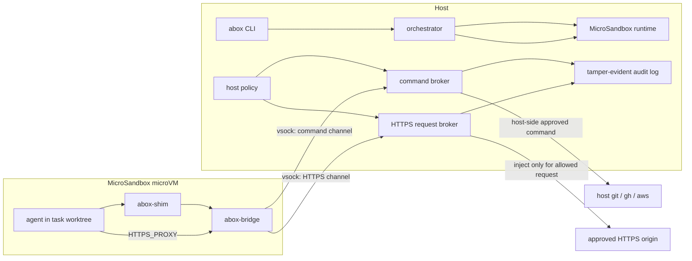

# abox — Least-Privilege Execution for Autonomous Coding Agents

`abox` is a least-privilege **execution and authorization layer** for autonomous
coding agents. It decides what an agent is allowed to do once isolated: which
workspace it works in, which privileged commands it may run, which API requests
carry credentials, and how every action is attributed and audited. Underneath,
each agent runs in a hardware-isolated microVM provided by the
[MicroSandbox](https://github.com/superradcompany/microsandbox) runtime
(libkrun: KVM on Linux, Hypervisor.framework on macOS Apple Silicon) — see
[ADR-008](docs/decisions/008-microsandbox-runtime-and-product-boundary.md).

## Why `abox`?

When running multiple autonomous agents on a single codebase, you face four problems:

1. **Workspace collisions:** Agents stepping on each other's git branches and files.
2. **Unbounded authority:** An agent that can run `git` can also run `git push --force`.
3. **Credential leaks:** Giving agents direct access to your AWS or GitHub tokens is dangerous.
4. **Host system risk:** Agents running `rm -rf /` or installing malware.

`abox` solves this by:

- Giving each agent an independent **git worktree** on its own branch, with
  deterministic divergence/merge semantics.
- Authorizing privileged host commands (`git`, `gh`, `aws`) action-by-action
  through a **strict, TOML-configured policy engine** — the guest never has the
  real binaries or credentials.
- Injecting API credentials into outbound HTTPS requests via a
  **TLS-terminating request broker**, with per-request method/path rules, so
  secrets never enter the sandbox.
- Recording every brokered command and request in a **tamper-evident audit
  log**, attributed to the sandbox that made it (attribution derives from the
  per-sandbox host route, never guest-asserted identity).
- Isolating each agent in a fast-booting **microVM** so none of the above
  depends on the agent's cooperation.

## Architecture

`abox` is built in Rust using a Hexagonal (Ports & Adapters) architecture.



Real credentials remain on the host: the command broker uses them only for an
approved host-side invocation, and the request broker injects them only into an
allowed request. The guest receives neither value.

1. **`abox-core`**: Domain logic — workspace manager, policy engine, the
   runtime-neutral `SandboxRuntimePort` boundary, and the MicroSandbox
   runtime adapter.
2. **`abox-cli`**: The user interface (CLI commands and TUI dashboard).
3. **`abox-proxyd`**: The host-side daemon that evaluates policies and executes allowed commands.
4. **`abox-shim`**: Static musl guest binaries — `abox-shim` intercepts
   commands (via symlinks) and forwards them to the host broker; `abox-bridge`
   forwards guest loopback/Unix-socket traffic over vsock.

The isolation mechanics — microVM execution, OCI image handling, mount
isolation, resource limits — are delegated to the MicroSandbox runtime. abox
owns the security semantics on top: what the agent is *authorized* to do. See
[`docs/runtime.md`](docs/runtime.md) for how the runtime works and
[`docs/security-model.md`](docs/security-model.md) for the threat model.

## Getting Started

### Platform support

- **Linux x86_64 and aarch64** with `/dev/kvm` accessible to your user.
- **macOS on Apple Silicon** via Hypervisor.framework.

### Prerequisites

- Rust toolchain (`cargo`)
- `just` command runner (`cargo install just`) — for development workflows
- **Linux only:** the libcap-ng development headers, needed at link time by
  the libkrun device layer (`libcap-ng-dev` on Debian/Ubuntu, `libcap-ng-devel`
  on Fedora)

### Installation

**From source** (recommended):

```bash
# Prerequisites: Rust (https://rustup.rs), just (cargo install just),
# and on Linux the libcap-ng headers (apt install libcap-ng-dev)
git clone https://github.com/X-McKay/abox.git
cd abox
cargo build --release

# Add the compiled binary to your PATH (or copy it to ~/.local/bin)
export PATH="$PWD/target/release:$PATH"

abox init             # guided first-run setup: installs the MicroSandbox
                      # runtime assets, generates the root CA, writes config,
                      # installs the default policy
abox doctor           # verify the environment before first use
```

There is no VM bootstrap step. `abox init` installs the MicroSandbox runtime
assets (`msb` + libkrunfw guest firmware) under `$MSB_HOME` (default
`~/.microsandbox`) via the SDK, and verifies each requested guest profile
resolves in the embedded image manifest.

**From release artifacts** (optional):

```bash
curl -fsSL https://raw.githubusercontent.com/X-McKay/abox/main/scripts/install.sh | bash
```

Release artifacts also ship static musl guest binaries (`abox-shim`,
`abox-bridge`) per architecture, staged under `~/.abox/guest/<arch>/` by
`abox init`. The official guest images bake fallback copies, so this staging
is an update path, not a hard requirement.

### Guest environment profiles

Guest profiles are OCI images (`ghcr.io/x-mckay/abox-guest-*`), resolved from
the manifest embedded in each abox release (`images/manifest.toml`) and pulled
on first use:

- `base`
- `node`
- `python`
- `python-glibc` — Python on a Debian/glibc base so `pip`/`uv` install
  `manylinux` wheels (numpy, pandas, scipy, …). Larger image than the musl
  `python` profile; choose it when you need prebuilt scientific wheels.
- `rust`

Repos select a *profile* in `.abox/project.toml`; they can never choose an
image reference. Images are digest-pinned by the publish workflow. Note: as of
this writing the images are not yet published, so the manifest digests are
unpinned and `abox doctor` reports them as such. A host-config
`[images.overrides]` escape hatch exists for development — see
[`images/README.md`](images/README.md).

### Documentation

- [`docs/tutorial.md`](docs/tutorial.md) — 10-minute walkthrough from
  `git clone` to your first sandbox
- [`docs/explainer.md`](docs/explainer.md) — architecture deep dive:
  what every component does and why
- [`docs/runtime.md`](docs/runtime.md) — the MicroSandbox runtime: host
  requirements, guest images, troubleshooting
- [`docs/profiles.md`](docs/profiles.md) — choosing and preparing the official
  guest environment profiles
- [`docs/security-model.md`](docs/security-model.md) — threat model and
  security invariants
- [`docs/audit-log.md`](docs/audit-log.md) — audit log format, verification,
  and tamper-evidence threat model
- [`docs/decisions/`](docs/decisions/) — architecture decision records
- [`docs/future-work.md`](docs/future-work.md) — forward-looking
  roadmap; what's next and why

### Configuration

The easiest way to configure abox is to run `abox init`, which writes
`~/.abox/config.toml` with sensible defaults and installs the default
policy automatically.

To configure manually:

```bash
mkdir -p ~/.abox/policies
cp templates/config.example.toml ~/.abox/config.toml
cp policies/default.toml ~/.abox/policies/default.toml
```

By default, abox stores all state under `~/.abox/` (worktrees, logs, and the
runtime socket directory). No root access required.

Run `abox doctor` at any time to check your environment for common setup
problems — hardware virtualization, the msb runtime assets, guest-binary
staging, and image-manifest resolution.

### Network modes

A repo's `.abox/project.toml` declares one of three network modes, compiled by
abox policy into a runtime plan (the runtime never decides what they mean):

- **`safe`** (default) — no guest networking at all. All egress rides the
  audited abox proxy channels (command broker + HTTPS egress proxy).
- **`scoped`** — native guest networking to *only* the resolved bundle hosts
  and approved domains, DNS-pinned and SNI-verified, TCP 443 + DNS only.
- **`open`** — native public-internet access only. Host, loopback, private
  ranges, link-local, and cloud metadata are always denied; TCP 443 + DNS
  only. **`open` is never unrestricted networking.**

`HTTPS_PROXY` stays pointed at the abox egress proxy in every mode, so
proxy-aware clients keep full per-domain audit and credential injection.
`abox project explain` reports the compiled network plan and per-rule
credential enforcement.

### Usage

1. **Probe the machine-readable capability envelope:**

   ```bash
   abox --capabilities
   ```

   Prints a JSON envelope describing supported protocol versions, task
   kinds, and execution engines. This bypasses config/policy loading so
   external harnesses can probe abox before first-run setup.

2. **Start an agent sandbox:**

   ```bash
   abox run --task fix-auth --base main -- claude
   ```

3. **Set up a repo-owned workflow with network intent and a guest profile:**

   ```bash
   abox project init --profile node

   cat > .abox/project.toml <<'EOF'
   [network]
   mode = "scoped"
   bundles = ["npm-public"]

   [environment]
   profile = "node"
   caches = ["npm"]
   prepare = ".abox/prepare.sh"
   EOF

   cat > .abox/prepare.sh <<'EOF'
   #!/bin/sh
   set -e
   npm ci --ignore-scripts --no-fund --no-audit
   EOF
   chmod +x .abox/prepare.sh

   abox project validate
   abox project trust
   abox env warm
   ```

4. **Launch a known managed agent with a prompt file:**

   ```bash
   abox run --task fix-auth --prompt-file prompts/fix-auth.md -- codex
   ```

5. **Start with runtime controls:**

   ```bash
   abox run --task fix-auth --timeout 300 --ephemeral -- claude
   # --timeout N: kill after N seconds (exit code 124)
   # --ephemeral: auto-remove sandbox after exit
   ```

6. **Override the repo's network mode for a single run:**

   ```bash
   abox run --task docs-scan --network open --prompt-file prompts/research.md -- claude
   ```

7. **Warm the repo environment:**

   ```bash
   abox env warm      # run the prepare flow once, persist durable caches
   abox env status    # report warm-state freshness
   ```

8. **List running sandboxes:**

   ```bash
   abox list
   ```

9. **Check divergence across agents:**

   ```bash
   abox divergence
   ```

10. **Merge a completed task:**

    ```bash
    abox merge fix-auth
    ```

11. **Manage the CA (for HTTPS credential injection):**

    ```bash
    abox ca show      # fingerprint + expiry
    abox ca rotate    # regenerate the root CA
    abox ca path      # print CA directory
    ```

    The CA certificate is staged into each guest at launch, so rotation
    takes effect on the next sandbox start.

12. **Enable managed auth providers (Claude Code, Codex):**

    ```bash
    # Edit ~/.abox/config.toml and add:
    # [auth.providers.claude]
    # enabled = true
    #
    # [auth.providers.codex]
    # enabled = true
    #
    # See docs/explainer.md Section 8 and docs/credential-scoping.md.
    ```

13. **Grant transparent credential injection for a service:**

    ```bash
    abox grant providers                 # list built-in shortcuts
    abox grant add openai                # inject $OPENAI_API_KEY into api.openai.com
    abox grant add my-svc --domain api.my.com --header Authorization --env MY_TOKEN
    abox grant list                      # show configured grants (incl. path rules)
    abox grant remove openai
    ```

    The agent only ever sees a placeholder — the real token is injected by the
    host proxy into outbound HTTPS and never enters the sandbox.

14. **Authorize an MCP server over OAuth (PKCE + state, refresh supported):**

    ```bash
    abox grant mcp auth https://mcp.example.com --client-id <id> --scopes "read write"
    abox grant mcp list
    abox grant mcp refresh example-com    # use the stored refresh token
    abox grant mcp remove example-com
    ```

    Tokens are stored under `~/.abox/mcp-tokens/<name>.json` with `0600`
    permissions.

15. **Ephemeral service sidecars (Postgres/Redis/Ollama/MySQL):**

    ```toml
    # .abox/project.toml
    [services]
    postgres = { version = "17" }
    redis = { version = "7" }
    ollama = { models = ["qwen2.5-coder:7b"] }
    ```

    ```bash
    abox services available              # list supported services
    abox services show                   # show this repo's configured services
    abox run --task feat -- claude       # starts services, injects ABOX_*_URL,
                                         # bridges them into the guest, tears down on exit
    ```

    Requires Docker on the host. The connection URL is injected as an env var
    (e.g. `ABOX_POSTGRES_URL`) reachable from inside the guest.

16. **Inspect and verify the tamper-evident audit log:**

    ```bash
    abox audit show -n 50                # recent proxied CLI/egress requests
    abox audit show --sandbox fix-auth --request-type egress
    abox audit verify                    # check the keyed hash chain + tip
    ```

    The chain is HMAC-keyed with a host-only key (`~/.abox/logs/audit.key`,
    `0600`) so a sandboxed agent cannot forge it, and truncation is detected via
    a persisted chain tip. See `docs/audit-log.md` for the threat model.

17. **Generate shell completions:**

    ```bash
    # Bash: source this now, or place the output in your completion directory.
    source <(abox completions bash)
    abox completions zsh > "${fpath[1]}/_abox"
    abox completions fish > ~/.config/fish/completions/abox.fish
    abox completions powershell >> $PROFILE
    ```

    Completion generation does not require an abox config or runtime setup.

### Profile notes

For profile-backed repo environments:

- `node` is validated for `npm`
- `python` is validated for `uv` / `pip3`, and prepare flows should prefer
  `uv`-managed virtual environments over `uv pip install --system`
- `python-glibc` is the same as `python` but runs on a Debian/glibc base;
  use it when your prepare flow installs packages that only ship `manylinux`
  wheels (numpy, pandas, scipy, etc.)
- `rust` is validated for `cargo`, but the current guest toolchain is
  `rustc/cargo 1.76.0`; repos requiring Cargo edition 2024 or Cargo.lock v4
  need a newer guest toolchain before warming

## Development

We use `just` as our command runner. Install it with `cargo install just`.

- `just check`: Run formatting, lints, and tests.
- `just lint`: Run clippy with strict warnings.
- `just build-guest-bins`: Build the static musl guest binaries
  (`abox-shim` + `abox-bridge`) for the host architecture.
- `just e2e-runtime`: Run the live MicroSandbox end-to-end suite
  (skips cleanly when the msb runtime assets are absent).
- `just bench`: Run Criterion microbenchmarks for policy evaluation and proxy
  serialization.

See [CONTRIBUTING.md](CONTRIBUTING.md) for detailed development guidelines.

## Performance

Run `just bench` for the criterion microbenchmarks (policy evaluation,
request serialization — no microVM needed). End-to-end latency depends on the
MicroSandbox runtime and the guest image cache; the live suite
(`just e2e-runtime`) exercises the full boot-to-exit path against real
microVMs. `just pre-release` runs the Criterion suite and requires its `bench`
attestation before a release can be cut.

## License

Apache 2.0
